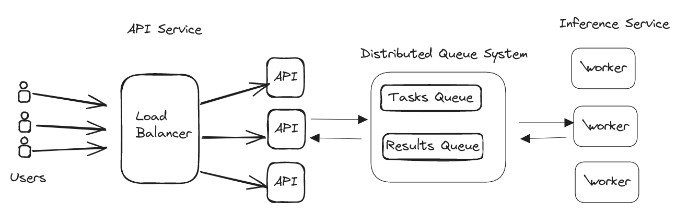

# Image Describer  Service

## Introduction

A system to infer image titles using an ML model.

### Requirements

Functional Requirements:

- Infer an image title through an API request, using the `microsoft/git-base-textcaps` model.

    `predict_image_title `

Non Functional Requirements:

- Highly Performant: expected to perform under load and volume.

- Fault Tolerant: tolerate mistakes or sw. exceptions.

- Highly Scalable: handles growth.

## System Design Solution

#### Simple Solution

A simpler solution,  more naive but yet functional is a system composed of load balancer in front of the service nodes, which run the API in an async manner and use queues to create tasks for requesting image titles to a pool of processes and get the inference results in a request/response cycle.

Sticky round-robin or dynamic load balancing algorithms to serve the requests based on the CPU usage of the services could improve performance and availability. Rate-limiting and throtling mechanisms should be implemented to guarante backpressure.

This approach can scale vertically and horizontally. Adding more powerfull machines and/or nodes during traffic peaks means the processing capability is extended, but yet there is a drawback, the API and the processing are coupled and can't scale separately.

A more robust, scalable and performant solution is desired.

The following solution doesn't rely on IPC using Python's `multiprocessing.queues`  but instead it introduces a distributed queue system so services can scale separately.

### API

#### Functionality

- Receives HTTP `POST` requests with base64 encoded images to infer titles.

    Performance: handles requests concurrently using an async WSGI server and an async connection with the queue system. This configuration allows high performance since we can process new requests while waiting on other I/O operations like getting the inference results from the queue. To ensure performance, the WSGI server tycally spawns different os processes.

    Availability: backpressure mechanisms like rate-limiting and throtling should be implemented to avoid an overflow of tasks that won't be served during a request/response cycle. Both services should be configured properly to scale accordingly in cases of traffic peaks.

    Security: For simplicity the endpoint doesn't require authentication but HTTPS (user-load balancer) should be used to ensure image data is encrypted.

- Stores a task for model inference.

  Availability: The task TTL matches the  **request timeout**  desired and configured according to the model inference times. When the request ends, the task pops from the queue avoiding unnecessary work.

  Scalability: Using a distributed queue system allows the system to ensure communication between the event producers and consumers, and scale over time configuring more complex queuing mechanisms and load balance different clusters of workers. Its tradeoff is increasing the overall design complexity.

- Waits for the task completion. If more flexibility is required, the TTL could be dynamically configured.

- Responds the request with the predicted image title, making any error handling (and logging).

### Worker

Since the main task is model inference which is CPU intensive, we won't benefit from using threads (GIL presents as a bottleneck for model inference) or async. The impact of I/O with the distributed queue system is minimal compared to the inference times.

To ensure high performance, the service makes a pool of processes to process tasks in parallel. The pool size is typically configured using the amount of cores a machine has.

For this design to keep simplicity each worker process will take a single task each time.

#### Functionality

- Loads the memory in memory.

- Reads tasks from a queue.

- Produces Model Inference.

    Performance: tasks could be given in batches to the model, taking advantage of the internal tensorflow capabilities of parallel processing but this increases complexity on the error handling.

- Stores the results in a queue.

- Stays waiting for more tasks.

This design allows us to highly scale. Adding more resources to the worker machines or by adding more machines.

## Development Plan

Due to the nature of the task, in order to code the described system in simple but yet functional manner the following technologies are chosen:

- Load Balancer: **Nginx** as reversed proxy and load balancer. (not included in the docker-compose file for simplicity)

  - API Service: **Django**:  Is "The web framework for perfectionists with deadlines" + **ASGI** server. Due the simplicity of the API another lightweight framework could be used but Django fairly reduces the amount of boilerplate and configuration.

- Distributed Queue System - Message Broker: **Redis**

- Worker Service: **Celery**

#### Considerations

- Load & Volume: (Make some numbers)

## Usage

`docker-compose build` and  `docker-compose  run`
