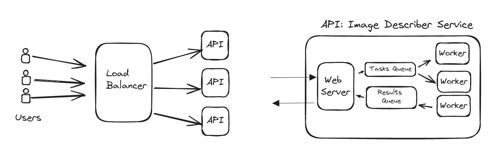
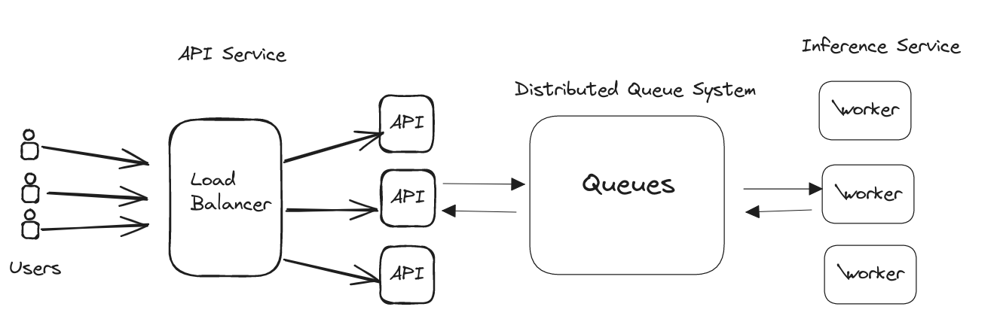
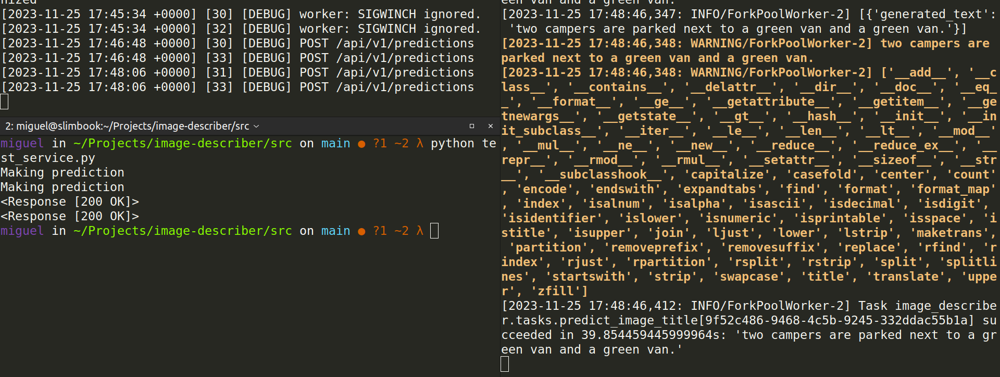
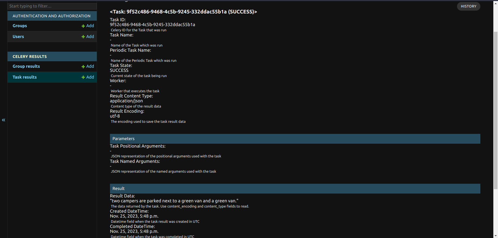

**Note: This was an interview technical challenge with around 10 hours of work. The Project is UNFINISHED**

# Image Describer  Service

- [TL;DR: Usage](#usage)
- [Design Solution](#system-design-solution)

## Introduction

A system to infer image titles using an ML model.

### Requirements

Functional Requirements:

- Infer an image title through an API request, using the `microsoft/git-base-textcaps` model.

    `predict_image_title `

Non Functional Requirements:

- **Highly Performant**: expected to perform under load and volume.

- **Highly Scalable**: handles growth.

- **Fault Tolerant**: tolerate mistakes or sw. exceptions.

## System Design Solution

#### Simple Solution

A simple solution,  is a system composed of load balancer in front of the service nodes, which run the API in an async manner and use queues to create tasks for requesting image titles to a pool of processes and get the inference results in a request/response cycle.

Sticky round-robin or dynamic load balancing algorithms serve the requests based on the CPU usage, improving performance and availability.

Rate-limiting and throtlting mechanisms should be implemented to guarantee back pressure.

This approach can scale vertically and horizontally. Adding more powerful machines and/or nodes during traffic peaks means the processing capability is extended, but yet there is a drawback, the API and the processing are coupled and can't scale separately.

*There must be a better way* - Raymond Hettinger.

A more robust, scalable and performant solution is desired so the following solution doesn't rely on IPC using Python's `multiprocessing.queues`  but instead it introduces a distributed queue system so services can scale separately.

##### High-level Solution Design

### API

#### Functionality

- Receives a JSON payload through HTTP `POST` requests, with  base64 encoded images.

- Stores a task for model inference.

- Waits for the task completion. If more flexibility is required, the TTL could be dynamically configured.

- Responds the request with the predicted image title, making any error handling (and logging).

**High Performance**

The system handles requests concurrently a WSGI threaded server.
This configuration allows high performance since we can process new requests while waiting on other I/O operations like getting the inference results from the queue.
To guarantee more concurrency and performance, the WSGI server typically spawns different OS processes.

**Scalability**

Using a distributed queue system allows the system to ensure communication between the event producers and consumers, scale over time and configure more complex queueing mechanisms, like implementing routing and load balancing different clusters of workers. This would increase the design complexity.

It scales horizontally and independently if required. A load balancer in front of the API services distributes the load using sticky round-robin.

**Availability**

The system could introduce backpressure mechanisms like rate-limiting and throttling to avoid an overflow of tasks that won't be served during a request/response cycle.

Both, API and worker services should be configured properly to scale accordingly in cases of traffic peaks.

The task TTL matches the  **request timeout**  desired and configured according to the model inference times. When the request ends, the task pops from the queue avoiding unnecessary work.

**Security**

For simplicity the API endpoint doesn't require authentication but HTTPS, between the user and the -load balancer, should be used to ensure image data is encrypted.

### Worker

#### Functionality

- Loads the model in memory.

- Reads tasks from a queue.

- Produces Model Inference.

- Stays waiting for more tasks.

**High Performance**

Since the main task is model inference which is CPU intensive, we won't benefit from using threads (GIL presents as a bottleneck for model inference) or async.

The time consumed in I/O communication is minimal compared to the model inference times (CPU).

The service makes a pool of processes to process tasks in parallel. The pool size is typically configured using the as default the  amount of cores physically available.

To keep the design simple each worker process will take a single task each time but  the worker could prefetch a batch of tasks and give it to the model, taking advantage of the internal tensorflow capabilities of parallel processing.

**Scalability**

This design allows us to highly scale, adding more resources to the worker machines or by adding more worker machines.

**Fault tolerant**

The system will introduce logging of the task results for monitoring and debugging purposes. It could move failed tasks to a dead-letter queue, allowing re-processing after error analysis or bug fixing  is complete.

Workers emit heartbeats notifying crashes to the broker, avoiding tasks are not lost and re-assigning them to other available workers.

## Final Design and disclaimers

**Due to the nature of the task**, in order to code the described system in simple but yet functional manner the following technologies are chosen:

- Load Balancer: **Nginx** as a reversed proxy and load balancer. (not included in the docker-compose file for simplicity)

  - API Service: **Django**:  Is "The web framework for perfectionists with deadlines" + **WSGI** server.

    :warning:    Due the simplicity of the API another lightweight framework could be used but Django fairly reduces the amount of boilerplate and configuration for redis and celery, pus gives a lot of extensibility for the future.

    - Django REST framework gives flexibility on creating specific API views with extra capabilities (rate limiting, throttling, caching decorators ...) **YAGNI** ?

    Plain Django views can be used with no DRF, but serializers simplify the code for handling HTTP error responses and validation.

    - Django's apps:  `celery-results` provides an admin interface  to monitor task results.

    - This design uses Gunicorn which is capable of handling multiprocess and multithreaded requests.

    :notepad: If using an ASGI server is required, it would also require some *async creep* updating Celery and Redis libraries to be non-blocking. Gaining performance but controlling how many tasks can be queued and served.

- Distributed Queue System - Message Broker: **Redis**

    :note: Configure `redis_max_connections` since by default there is no limit.

- Worker Service: **Celery**

  Integration with Django is standard and pretty straight forward. It provides tons of features: Heartbeats, multiprocessing/concurrency, prefetching, autoscaling, handling worker memory usage, remote controls, worker inspection ...

  The model is loaded on a singleton on worker initialization, avoiding a cold start for first incoming tasks.

  Celery configuration: `celery.py`
  Tasks declaration: `tasks.py`

#### Future Considerations

- Load & Volume: (Make some numbers)

- `api` and `worker` could be decoupled in different projects. Making a tasks libray installable by both services. For simplicity all lives in the same code repository but runs in different machines.

## Usage

Requires: [Docker](https://www.docker.com/) and [docker-compose](https://docs.docker.com/compose/)

**Run**:

`docker-compose build`

`docker-compose up`

API will be running on `localhost:9000/api/v1/predictions` and the worker listening for inference tasks.

Create a super user to access django's admin panel in `localhost:9000/admin`
by doing

`docker-compose run -p 9000:9000 api bash`  and then `python manage.py createsuperuser`

The admin shows the task results.

**Test and Debug**:

To test the integration run `python test_service.py` from the `src` folder when both services are up and running.

See results.

To run unit tests:

`docker-compose run -p 9000:9000 api bash`  and then `pytest -s tests`

or

`docker-compose run -p 9000:9000 api pytest -s tests`

Use **volumes** in `docker-compose` to mount your code and run and debug your tests inside docker without rebuilding the image.
